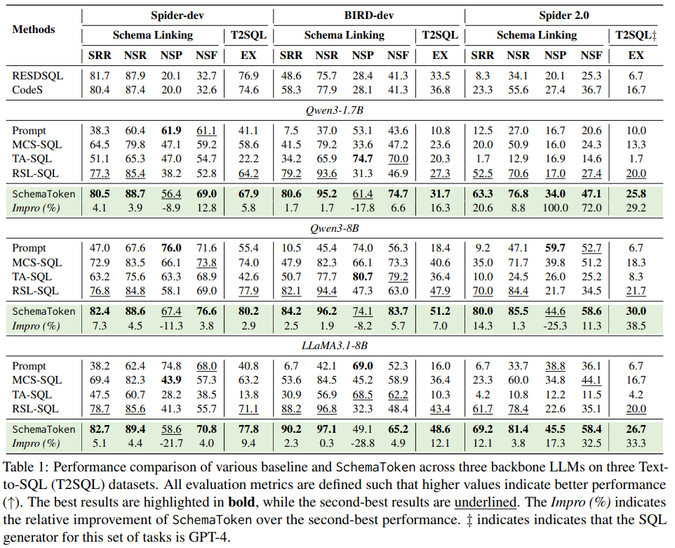
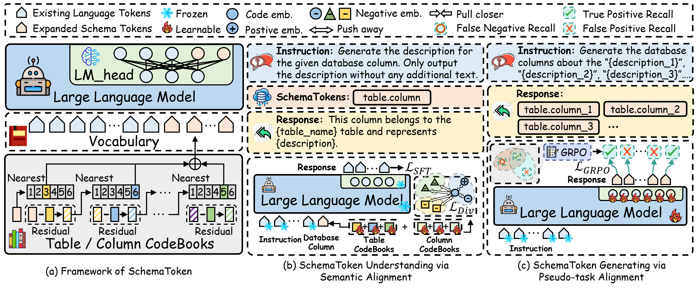

# SchemaToken

This is the pytorch implementation of our manuscript:

> SchemaToken: Tokenizing Database Schemas for Efficient and Robust Text-to-SQL Linking

# Apology and Clarification Regarding Table 1 Rendering Error

Dear Reviewers, Area Chair, and Program Committee Members,

We sincerely apologize for a serious mistake in the submitted version of our manuscript.

Due to an unintended LaTeX syntax error, the experimental results in Table 1, where certain numbers were intended to be highlighted with underlines, were rendered incorrectly in the compiled PDF. As a result, the numerical values shown in the final PDF do not correspond to the correct experimental results, which may have caused confusion or misunderstanding when assessing our main empirical findings.

We fully acknowledge that Table 1 contains the primary experimental results of our manuscript, and this error reflects a lack of sufficient care on our part during the final manuscript preparation. We deeply regret any inconvenience, confusion, or additional burden this mistake may have caused to the reviewers, the Area Chair, and the Program Committee.

To address this issue transparently, we have included the corrected and verified version of Table 1 in the “Anonymous Repository” (**https://anonymous.4open.science/r/SchemaToken/schemaToken_main_result.png**), where all results are accurately reported. We would like to emphasize that the corrected table does not change any claims, conclusions, or comparisons made in the manuscript, but we fully understand that the original presentation error undermines clarity and trust.

Once again, we sincerely apologize for this oversight and for any negative impact it may have had on the review process. We are grateful for your time, effort, and careful consideration of our work, and we truly appreciate your understanding.

\noindent Respectfully and sincerely,

\noindent All authors of submission 10330

<p align="center">
  
</p>

## Overview
Schema linking is a crucial step in Text-to-SQL systems, connecting natural language mentions to relevant database tables and columns. Despite recent advances in LLM-based Text-to-SQL models, current approaches face two fundamental limitations: (1) providing detailed column descriptions inflates the input context, often exceeding the model’s effective sequence length, and (2) predicting multi-token column names increases output complexity, making the task fragile to generation errors. To address these challenges, we propose SchemaToken, which represents each database column as a dedicated token in the LLM’s vocabulary. This design compresses column semantics into single embeddings, reducing context length and simplifying prediction. We introduce a two-stage training paradigm: (i) Semantic Alignment, which enables the LLM to understand the newly added schema tokens via structured embeddings, and (ii) Pseudo-task Alignment, which trains the LLM to generate these tokens as an unordered set using reinforcement learning with a Jaccard-based reward. Experiments on multiple benchmark datasets demonstrate that SchemaToken significantly improves schema linking performance, particularly for large and complex schemas, while maintaining computational efficiency. 

<p align="center">
  
</p>

# Data Download
Download datasets from the official repository of [Spider](https://yale-lily.github.io/spider) and [BIRD](https://bird-bench.github.io/)

## Data Preparation
```bash
python preprocess.py
```

## Initialize embedding
```bash
python init_embed.py
```

## Model Training
```bash
python train.py
```

# Model Inference
```bash
python eval.py
```
